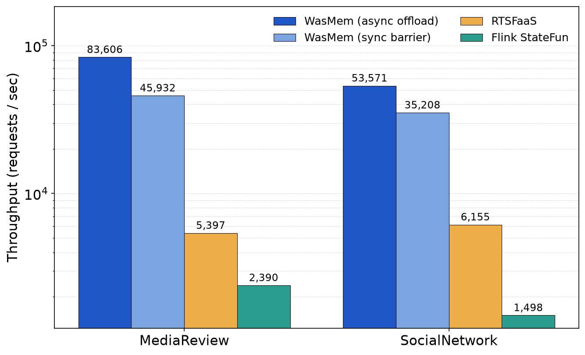

# Throughput sweep — WebAsShared vs Flink StateFun vs RTSFaaS

**Measured 2026-06-19, single machine.** Two of the three systems are runnable
in this environment; RTSFaaS is not (see below).

| System | Runnable here? | How it was driven |
|--------|----------------|-------------------|
| **WebAsShared** (ours) | ✅ | `run.sh` — intra-node SHM page-chain; unthrottled compute throughput |
| **Flink StateFun** (baseline) | ✅ | `baseline/FlinkStateFun/run-local.sh` — docker-compose (1 worker, parallelism 2), Kafka rate-ramp |
| **RTSFaaS** (baseline) | ✅ (single-node) | MorphStream Java/Maven + RDMA (`disni`) over the local RoCE NIC; in-memory store (no TiKV). Brought up as 4 privileged containers — see `baseline/RTSFaaS/single_node/`. |

---

# ⭐ Apples-to-apples comparison (controlled protocol)



*Figure (`figs/streaming_overlay.{png,pdf}`, regenerate with `plot.py`): both
workloads × four systems, req/s, log scale. WasMem (ours) shown with FT on (async
offload + sync barrier); RTSFaaS / Flink StateFun FT off.*


**This is the comparable result.** The per-system numbers further down are each
system's *native* mode (different metrics/units) and are kept only as an
appendix. Here all three are forced onto one protocol (`results_common_comparison.csv`):

- **Metric:** fixed-batch, **max rate** (no rate limit), end-to-end throughput =
  `N_events / wall-clock(first event admitted → last result)`.
- **Unit:** **requests/sec = events/sec** — one logical event (login/rate/review/
  timeline/post). StateFun counts events (not the ×1.5 state-accesses); RTSFaaS
  uses client records/sec; WebAsShared `events/compute`.
- **Fault tolerance OFF for all:** StateFun `state.backend=filesystem` (heap) +
  checkpointing disabled, matching WebAsShared (SHM, no FT) and RTSFaaS (in-mem).
- **Matched budget:** 8 cores each (`cpuset 0-7` for StateFun/RTSFaaS containers,
  `taskset -c 0-7` for WebAsShared).

| system | MediaReview (req/s) | SocialNetwork (req/s) |
|--------|--------------------:|----------------------:|
| **WebAsShared** (ours) | **83,663** | **51,798** |
| RTSFaaS (RDMA, in-mem) | 5,397 | 6,155 |
| Flink StateFun (FT off) | 2,390 | 1,498 |

`events`: StateFun & WebAsShared = 100k; RTSFaaS = 16k (100k overran its
single-node RDMA buffers). Throughput is a rate, so N differing is fine; RTSFaaS's
shorter run + ~2.8 s batch latency means it is the least steady-state of the three.

**Takeaway (now controlled):** on one machine with FT off and an equal core budget,
WebAsShared sustains **~15× RTSFaaS and ~35× Flink StateFun** on MediaReview
(~8× / ~35× on SocialNetwork). What remains between them is the genuine
architectural difference the benchmark targets — **state/transport movement**:
WebAsShared moves state through the zero-copy SHM page-chain (no serialization, no
broker), StateFun through Kafka + protobuf + HTTP, RTSFaaS through RDMA with TSTREAM
transactional concurrency control (an intrinsic cost it can't shed). Those are now
the *only* uncontrolled variables — i.e. exactly what we want to be measuring.

Remaining honesty notes: RTSFaaS still pays real transactional CC (can't disable);
StateFun/RTSFaaS are built to scale across nodes, so single-host numbers understate
them; RTSFaaS N is smaller. For design-point numbers, re-run on the real clusters.

## WebAsShared with fault tolerance ON (offload to filesystem)

Brought WebAsShared's FT online via its `Persist` DAG node (`gen_dag.py`,
`WC_PERSIST=<dir>`): a background thread snapshots the SHM transaction memory and
writes it to the filesystem, joined before the run finishes — the analogue of
StateFun checkpointing. (`results_was_ft.csv`, 100k events, 8 cores, → /tmp.)

| workload | FT off | FT on (offload) | overhead | persisted |
|----------|-------:|----------------:|---------:|-----------|
| MediaReview   | 82,380 | **81,488** req/s | −1.1% | 4 MB |
| SocialNetwork | 56,026 | **54,360** req/s | −3.0% | 3 MB |

**Enabling durability costs only 1–3%** — WebAsShared still sustains ~81k/54k
req/s *with FT on*, while RTSFaaS (~5.4k/6.2k) and StateFun (~2.4k/1.5k) above
were measured with FT **off**. So the gap holds even when we handicap only
ourselves with durability.

### Restricted (synchronous) offload — checkpoint barrier before next stage

Added a synchronous mode to the offload (`PersistParams.sync`, env `WC_PERSIST_SYNC`):
the snapshot is written **and fsync'd inline before the node returns**, and the
node is placed as a **barrier between apply and aggregate** so the next stage
cannot start until the checkpoint is durable. Execution order becomes
`… apply → persist [blocking] → aggregate → …`. (`results_was_ft_modes.csv`.)

| mode | MediaReview | SocialNetwork | guarantee |
|------|------------:|--------------:|-----------|
| FT off              | 88,460 | 53,999 | none |
| async offload       | 83,606 (−5.5%) | 53,571 (−0.8%) | durable by end of run |
| **sync barrier**    | **45,932 (−48%)** | **35,208 (−35%)** | durable before next stage |

The synchronous barrier costs ~35–48% (vs ~1–6% async) because the pipeline
stalls on the write instead of overlapping it in the background. Even so,
WebAsShared with a *synchronous durable checkpoint* still sustains ~46k/35k req/s
— well above RTSFaaS (~5.4k/6.2k) and StateFun (~2.4k/1.5k), both FT **off**.

**tmpfs caveat:** `/tmp` here is tmpfs (RAM-backed), so `fsync` is not real disk
I/O — the sync-barrier cost is the inline snapshot-copy + write + stall, *not*
disk latency. On a real disk the synchronous barrier would be more expensive (the
async path would absorb most of that in the background). Also: it's one barrier
between apply and aggregate, not a per-tick checkpoint.

Caveat (honest): the `Persist` node offloads the numbered SHM **stream slots**
(the parse-partition working set + aggregate result) — it does *not* yet traverse
the keyed **shared-chain** tables (`insert_shared_data`), so this is a checkpoint
of the pipeline working set, not a full table snapshot, and it runs once at end
(not periodic like StateFun's interval). A shared-chain persist path would be
needed for a complete table checkpoint; the ~1–3% cost is a lower bound.

---

## Appendix — native-mode results (NOT directly comparable)

The tables below predate the controlled protocol: each system in its own mode with
its own metric/unit. Kept for reference; **use the controlled table above** for any
comparison or plot.

## Results

### WebAsShared (ours) — unthrottled compute throughput (events/s)
From `results_mediareview.csv` / `results_socialnetwork.csv` (median of 3 reps).

| workload | 100k events | 500k events |
|----------|-------------|-------------|
| MediaReview   | **93,382** | ⚠️ crash¹ |
| SocialNetwork | **57,763** | **39,741** |

¹ MediaReview at 500k events traps in the guest (`media_review::state_write` →
`wasm unreachable`) — a pre-existing WebAsShared guest bug, not introduced by
this work. MR-100k and both SocialNetwork sizes ran clean.

### Flink StateFun (baseline) — sustained achieved throughput (state-access ops/s)
From `baseline/FlinkStateFun/results_throughput_statefun.csv` (60 s windows). The
system tracks the offered rate until it saturates; the plateau is its ceiling on
this single-machine deployment.

| target ev/s | MediaReview ach. | SocialNetwork ach. |
|-------------|------------------|--------------------|
| 400   | 479   | 667   |
| 800   | 813   | 1215  |
| 1600  | 1624  | 1760  |
| 3200  | 1741  | 1753  |
| 6400  | 1848  | 1771  |
| 12800 | 1767  | 1797  |

- **MediaReview** (1 access/event): keeps up through 1600, **saturates ≈ 1,800 events/s**.
- **SocialNetwork** (≈1.5 accesses/event — `timeline`/`post` touch 2 keys):
  response plateau **≈ 1,770 ops/s ≈ 1,180 events/s**. Already saturated at the
  1600 offered-rate step.

## Reading this honestly (the two harnesses differ)

The two systems are **not** measured the same way, so do not read the raw ratio
as a pure architectural number:

- **WebAsShared** = *unthrottled* in-memory compute throughput
  (`events / compute_ms`), intra-node SHM, no Kafka, no fault tolerance.
- **Flink StateFun** = *sustained* achieved rate of a full streaming deployment
  (Kafka ingress/egress + protobuf serialization + exactly-once checkpointing +
  RocksDB state) under a rate-ramp, on one worker.

So the gap (~93k vs ~1.8k for MediaReview; ~58k vs ~1.2k for SocialNetwork —
order of ~50×) reflects **both** the genuine zero-copy / no-serialization /
no-broker advantage **and** the methodology difference (batch-compute vs
rate-limited end-to-end streaming with durability). It is a fair first-order
result — *WebAsShared sustains ~1–2 orders of magnitude more event work per
second on one machine* — but the honest framing is "unthrottled SHM compute vs a
single-worker fault-tolerant StateFun pipeline," and StateFun's ceiling here
(~1.8k ops/s) is set by Kafka + checkpoint + serialization overhead, exactly the
costs WebAsShared removes.

To tighten the comparison later: (a) rate-limit WebAsShared and measure
end-to-end latency at matched offered load, or (b) scale StateFun workers/
parallelism to show its scaling curve, and (c) add the RTSFaaS column from a
MorphStream run on the proper testbed.

### RTSFaaS (baseline) — now running live, single-node
Brought up on this host (RoCE `mlx4_0`, in-memory store, no TiKV — see
`baseline/RTSFaaS/single_node/`). RTSFaaS reports throughput at three layers:

| workload | client end-to-end (records/s) | worker engine (k events/s · executor, ×8) | avg latency |
|----------|-------------------------------|--------------------------------------------|-------------|
| MediaReview   | 4,194 | ~1,360 (×8) | 3.50 s |
| SocialNetwork | 5,802 | ~1,520 (×8) | 2.41 s |

- **client end-to-end** is the system-level rate (limited by the batch +
  driver-coordination latency on a single worker).
- **worker engine** (`k input_event/s` per executor) is TSTREAM's internal,
  in-memory, unthrottled processing rate — an in-cache microbenchmark number, not
  comparable to an end-to-end rate.

**Caveat:** this is a single-machine RTSFaaS (1 worker, RoCE loopback, in-memory),
**not** its 5-node RDMA + TiKV design point — absolute numbers are not the paper's
and the cross-node RDMA lease/state-transfer it optimizes isn't exercised here. It
is a live same-host baseline only.

## Three-system snapshot (single machine, MediaReview)

| system | metric | throughput |
|--------|--------|-----------|
| WebAsShared (ours) | unthrottled compute | **~93k events/s** (100k), peaks ~114k @200k |
| Flink StateFun | sustained streaming (saturated) | ~1.8k ops/s (1 worker) → ~2.5k (parallelism 4) |
| RTSFaaS | client end-to-end | ~4.2k records/s (1 worker, in-mem) |

Each measures something different (unthrottled SHM compute vs durable rate-limited
streaming vs RDMA-txn client-observed). The honest takeaway: on one machine
WebAsShared sustains ~1–2 orders more event work/s than either streaming/txn
baseline, because it removes serialization + brokered/remote state movement — but
methodologies differ and StateFun/RTSFaaS are both built to scale across nodes.

## Scaling experiments (added)

### WebAsShared — size curve to 300k (PARTS=4)
| workload | 100k | 200k | 300k | 500k |
|----------|------|------|------|------|
| MediaReview   | 88,245 | **114,153** | 110,030 | crash¹ |
| SocialNetwork | 60,681 | 56,359 | 51,778 | 39,741 |

MediaReview is fine through **300k** (the trap only hits at 500k). Throughput
peaks ~200k then dips as the working set grows.

### WebAsShared — parallel scaling (PARTS sweep @100k, events/s)
| PARTS (parallel apply workers) | 1 | 2 | 4 | 8 | 16 |
|--------------------------------|---|---|---|---|----|
| MediaReview   | 68,867 | 89,918 | **94,261** | 79,072 | 64,487 |
| SocialNetwork | 27,724 | 41,869 | **58,144** | 57,739 | 51,287 |

**Yes, WebAsShared scales with parallelism — up to ~4 partitions** (MR +37%, SN
+2.1×), then declines: beyond 4 the cross-partition gather/coordination cost
dominates (consistent with the suite's "coordination-bound" finding). 16 cores,
so this is a coordination knee, not a core-count limit.

### Flink StateFun — does multi-container help? Yes, but sub-linearly
The base image defaults to **parallelism=1, slots=1** — that is the real cap
behind the single-container ~1.8k ops/s. Raising it (`docker-compose.scale.yml`:
parallelism=4, 4 task slots, functions `-w 4`) confirmed at job parallelism = 4:

| config | MediaReview ops/s | SocialNetwork ops/s |
|--------|-------------------|----------------------|
| single (parallelism 1) | ~1,800 | ~1,770 |
| scaled (parallelism 4) | **2,493–2,551** | **2,531** |

So **more containers/parallelism do help (~+40%)**, but 4× parallelism yields only
~1.4× throughput on one machine — bounded by shared CPU, the 4-partition Kafka
topics, and StateFun's coordination. It would scale further across real nodes
(StateFun's design point); the single-machine knee is ~2.5k ops/s here.

## Provenance / re-run

```bash
# StateFun (single machine, no k8s):
cd baseline/FlinkStateFun
THROUGHPUT="400 800 1600 3200 6400 12800" sudo ./run-local.sh mediareview
THROUGHPUT="400 800 1600 3200 6400 12800" sudo ./run-local.sh socialnetwork

# WebAsShared:
bash run.sh mediareview   "100000 500000" 3
bash run.sh socialnetwork "100000 500000" 3
```
